# TickerPing 24/7 GitHub Actions Cloud Bot Implementation Plan

> **For agentic workers:** REQUIRED SUB-SKILL: Use superpowers:subagent-driven-development to implement this plan task-by-task. Steps use checkbox (`- [ ]`) syntax for tracking.

**Goal:** Run TickerPing 24/7 autonomously on GitHub Actions with a 4.3-minute (260s) internal loop checking stock prices and processing 2-way Telegram commands from the user's phone, with zero server sleep and zero PC dependency.

**Architecture:** A unified runner script ([`cloud_runner.py`](file:///c:/Users/DrorVizel/Downloads/StockAlarmer/cloud_runner.py)) executes in GitHub Actions every 5 minutes. The script runs an internal 60-second loop up to a 260-second timeout budget. In each iteration, it fetches unread Telegram messages via `getUpdates` to process commands (`/set`, `/del`, `/list`, `/price`, shorthand `AAPL 340`), sends instant replies, evaluates active alarms using Yahoo Finance, generates stock charts for triggers, sends rich photo alerts, and persists updated alarms and Telegram offsets back to git.

**Architecture Diagram:**

```mermaid
graph TD
    subgraph GitHub_Actions_Cloud ["GitHub Actions Cloud (Every 5 mins)"]
        Cron["Cron Schedule (*/5 * * * *)"] --> Runner["cloud_runner.py"]
        Runner --> StateInit["Load alarms.json & bot_state.json"]
        StateInit --> InnerLoop["Loop (up to 260s, step=60s)"]
        InnerLoop --> PollTg["Telegram getUpdates"]
        PollTg --> HandleCmds["Execute Commands (/set, /del, /list, AAPL 340) & Reply"]
        HandleCmds --> CheckPrices["StockEngine.get_quote()"]
        CheckPrices --> EvalTriggers{"Target Hit?"}
        EvalTriggers -- Yes --> GenChart["chart.py: generate_stock_chart()"]
        GenChart --> AlertTg["notifier.py: send_alert()"]
        AlertTg --> SaveState["Save alarms.json"]
        EvalTriggers -- No --> SleepCycle["Sleep to next 60s mark"]
        SaveState --> SleepCycle
        SleepCycle --> InnerLoop
        InnerLoop -- "260s Exceeded" --> GitPush["Git commit & push [skip ci]"]
    end
```



**Tech Stack:** Python 3.12, GitHub Actions, `yfinance`, `matplotlib`, `requests`, `python-dotenv`, `pytest`, Telegram Bot API.

## Global Constraints
- Target repository: `droritos/TickerPing` on branch `main`.
- Cloud runner must gracefully terminate within 260 seconds before GitHub's next 5-minute schedule kicks in.
- Zero local PC processes: all continuous execution must occur in GitHub Actions cloud.
- Git commit identity for automated pushes must be `github-actions[bot]`.
- Existing test suite (15 tests) must remain 100% green.

---

### Task 1: State Management for Telegram Bot Offset

**Files:**
- Create: `bot_state.py`
- Test: `tests/test_bot_state.py`

**Interfaces:**
- Consumes: JSON file persistence for offset tracking.
- Produces: `BotStateManager` class with `get_last_offset()` and `set_last_offset(offset: int)`.

- [ ] **Step 1: Write the failing test**

```python
# tests/test_bot_state.py
import os
import json
import pytest
from bot_state import BotStateManager

def test_bot_state_default(tmp_path):
    state_file = str(tmp_path / "bot_state.json")
    manager = BotStateManager(storage_path=state_file)
    assert manager.get_last_offset() == 0

def test_bot_state_save_and_load(tmp_path):
    state_file = str(tmp_path / "bot_state.json")
    manager = BotStateManager(storage_path=state_file)
    manager.set_last_offset(12345)
    assert manager.get_last_offset() == 12345

    # Reload from disk
    manager2 = BotStateManager(storage_path=state_file)
    assert manager2.get_last_offset() == 12345
```

- [ ] **Step 2: Run test to verify it fails**

Run: `python -m pytest tests/test_bot_state.py -v`  
Expected: FAIL with `ModuleNotFoundError: No module named 'bot_state'`

- [ ] **Step 3: Write minimal implementation**

```python
# bot_state.py
import json
import os
import logging
from typing import Dict, Any

logger = logging.getLogger(__name__)

class BotStateManager:
    def __init__(self, storage_path: str = "bot_state.json"):
        self.storage_path = storage_path
        self._ensure_file_exists()

    def _ensure_file_exists(self):
        if not os.path.exists(self.storage_path):
            self._write_state({"last_update_id": 0})

    def _read_state(self) -> Dict[str, Any]:
        try:
            if not os.path.exists(self.storage_path):
                return {"last_update_id": 0}
            with open(self.storage_path, "r", encoding="utf-8") as f:
                content = f.read().strip()
                if not content:
                    return {"last_update_id": 0}
                return json.loads(content)
        except Exception as e:
            logger.error(f"Error reading bot state: {e}")
            return {"last_update_id": 0}

    def _write_state(self, state: Dict[str, Any]):
        try:
            temp_path = f"{self.storage_path}.tmp"
            with open(temp_path, "w", encoding="utf-8") as f:
                json.dump(state, f, indent=2)
            if os.path.exists(self.storage_path):
                os.replace(temp_path, self.storage_path)
            else:
                os.rename(temp_path, self.storage_path)
        except Exception as e:
            logger.error(f"Error writing bot state: {e}")

    def get_last_offset(self) -> int:
        return self._read_state().get("last_update_id", 0)

    def set_last_offset(self, offset: int):
        state = self._read_state()
        state["last_update_id"] = offset
        self._write_state(state)
```

- [ ] **Step 4: Run test to verify it passes**

Run: `python -m pytest tests/test_bot_state.py -v`  
Expected: PASS (2 passed)

- [ ] **Step 5: Commit**

```bash
git add bot_state.py tests/test_bot_state.py
git commit -m "feat: add BotStateManager for Telegram offset persistence"
```

---

### Task 2: Core Telegram Command Handler Logic

**Files:**
- Create: `telegram_command_handler.py`
- Test: `tests/test_telegram_command_handler.py`

**Interfaces:**
- Consumes: `AlarmManager`, `StockEngine`, `send_message` callable.
- Produces: `TelegramCommandHandler` with `handle_update(update: dict) -> bool` and command routing for `/start`, `/help`, `/price`, `/list`, `/del`, `/check`, and shorthand `AAPL 340`.

- [ ] **Step 1: Write the failing test**

```python
# tests/test_telegram_command_handler.py
import pytest
from unittest.mock import MagicMock
from alarms_manager import AlarmManager
from engine import Quote
from telegram_command_handler import TelegramCommandHandler

@pytest.fixture
def mock_engine():
    engine = MagicMock()
    engine.get_quote.return_value = Quote(
        symbol="AAPL",
        price=230.0,
        change_percent=1.5,
        currency="USD",
        previous_close=226.6,
        day_high=232.0,
        day_low=225.0
    )
    return engine

@pytest.fixture
def mock_alarms(tmp_path):
    storage = str(tmp_path / "test_alarms.json")
    return AlarmManager(storage_path=storage)

def test_handle_shorthand_set(mock_engine, mock_alarms):
    sent_messages = []
    def mock_send(chat_id, text):
        sent_messages.append((chat_id, text))

    handler = TelegramCommandHandler(
        alarm_manager=mock_alarms,
        engine=mock_engine,
        send_msg_fn=mock_send
    )

    update = {
        "update_id": 100,
        "message": {
            "chat": {"id": 1438330510},
            "text": "AAPL 250"
        }
    }

    handled = handler.handle_update(update)
    assert handled is True
    assert len(sent_messages) == 2  # Checking... and Alarm Set Successfully
    assert "Alarm Set Successfully" in sent_messages[1][1]
    
    alarms = mock_alarms.get_alarms()
    assert len(alarms) == 1
    assert alarms[0]["ticker"] == "AAPL"
    assert alarms[0]["target_price"] == 250.0
    assert alarms[0]["direction"] == "ABOVE"
```

- [ ] **Step 2: Run test to verify it fails**

Run: `python -m pytest tests/test_telegram_command_handler.py -v`  
Expected: FAIL with `ModuleNotFoundError: No module named 'telegram_command_handler'`

- [ ] **Step 3: Write minimal implementation**

```python
# telegram_command_handler.py
import logging
from typing import Callable, List, Dict, Any, Optional
from engine import StockEngine
from alarms_manager import AlarmManager

logger = logging.getLogger(__name__)

class TelegramCommandHandler:
    def __init__(
        self,
        alarm_manager: AlarmManager,
        engine: StockEngine,
        send_msg_fn: Callable[[str, str], None]
    ):
        self.alarm_manager = alarm_manager
        self.engine = engine
        self.send_msg = send_msg_fn

    def handle_update(self, update: Dict[str, Any]) -> bool:
        msg = update.get("message")
        if not msg or "text" not in msg:
            return False

        chat_id = str(msg["chat"]["id"])
        text = msg["text"].strip()
        tokens = text.split()
        if not tokens:
            return False

        cmd = tokens[0].lower()

        if cmd in ("/start", "/help", "help"):
            self.handle_start(chat_id)
        elif cmd in ("/set", "/add", "add", "set"):
            self.handle_set(chat_id, tokens[1:])
        elif cmd in ("/list", "/alarms", "list", "alarms"):
            self.handle_list(chat_id)
        elif cmd in ("/del", "/delete", "/rm", "del", "delete"):
            if len(tokens) > 1:
                self.handle_delete(chat_id, tokens[1])
            else:
                self.send_msg(chat_id, "⚠️ Specify what to delete, e.g.: <code>/del AAPL</code>")
        elif cmd in ("/price", "/quote", "price", "quote"):
            if len(tokens) > 1:
                self.handle_price(chat_id, tokens[1])
            else:
                self.send_msg(chat_id, "⚠️ Specify a ticker, e.g.: <code>/price AAPL</code>")
        else:
            # Smart parse: "AAPL 340" or "NVDA 130 ABOVE"
            if len(tokens) >= 2 and tokens[1].replace(".", "", 1).replace("$", "").isdigit():
                self.handle_set(chat_id, tokens)
            else:
                self.send_msg(chat_id, "❓ Unknown command. Send <code>/help</code> or <code>AAPL 340</code> to set an alarm.")

        return True

    def handle_start(self, chat_id: str):
        msg = (
            "📈 <b>Welcome to TickerPing Cloud!</b>\n\n"
            "You can manage your stock alarms directly from your phone:\n\n"
            "<b>➕ Add Alarm:</b>\n"
            "<code>/set AAPL 340 ABOVE</code>\n"
            "<code>/set TSLA 210 BELOW</code>\n"
            "<i>(Or simply send: <code>AAPL 340</code>)</i>\n\n"
            "<b>📋 Other Commands:</b>\n"
            "• <code>/list</code> — View your active alarms\n"
            "• <code>/del AAPL</code> — Delete an alarm\n"
            "• <code>/price AAPL</code> — Check live quote\n"
            "• <code>/help</code> — Show this guide\n\n"
            "⏰ <i>Alarms are monitored 24/7 in the cloud!</i>"
        )
        self.send_msg(chat_id, msg)

    def handle_price(self, chat_id: str, ticker: str):
        clean = ticker.strip().upper()
        quote = self.engine.get_quote(clean)
        if not quote:
            self.send_msg(chat_id, f"❌ Could not find quote for <b>{clean}</b>. Please check the ticker symbol.")
            return
        sign = "+" if quote.change_percent >= 0 else ""
        msg = (
            f"📊 <b>{quote.symbol} Live Quote</b>\n\n"
            f"💰 <b>Price:</b> ${quote.price:,.2f} {quote.currency}\n"
            f"📈 <b>Session Change:</b> {sign}{quote.change_percent:.2f}%\n"
            f"🏁 <b>Previous Close:</b> ${quote.previous_close:,.2f}"
        )
        self.send_msg(chat_id, msg)

    def handle_set(self, chat_id: str, args: List[str]):
        if len(args) < 2:
            self.send_msg(chat_id, "⚠️ Usage: <code>/set TICKER TARGET_PRICE [ABOVE/BELOW] [NOTE]</code>\nExample: <code>/set AAPL 340 ABOVE Breakout</code>")
            return

        ticker = args[0].strip().upper()
        try:
            target_price = float(args[1].replace("$", ""))
        except ValueError:
            self.send_msg(chat_id, f"❌ Invalid target price: '{args[1]}'. Must be a number like 250.50")
            return

        direction = "ABOVE"
        note = ""

        if len(args) >= 3 and args[2].upper() in ("ABOVE", "BELOW"):
            direction = args[2].upper()
            if len(args) >= 4:
                note = " ".join(args[3:])
        elif len(args) >= 3:
            note = " ".join(args[2:])

        self.send_msg(chat_id, f"🔍 Checking <b>{ticker}</b>...")
        quote = self.engine.get_quote(ticker)
        if not quote:
            self.send_msg(chat_id, f"❌ Ticker <b>{ticker}</b> not found on Yahoo Finance. Please verify the symbol.")
            return

        if len(args) < 3:
            if target_price < quote.price:
                direction = "BELOW"
            else:
                direction = "ABOVE"

        alarm = self.alarm_manager.add_alarm(
            ticker=ticker,
            target_price=target_price,
            direction=direction,
            note=note
        )

        diff = round(((target_price - quote.price) / quote.price) * 100, 2)
        diff_sign = "+" if diff > 0 else ""

        msg = (
            f"✅ <b>Alarm Set Successfully!</b>\n\n"
            f"🎯 <b>{ticker}</b>: Alert when price is <b>{direction} ${target_price:,.2f}</b>\n"
            f"💰 <b>Current Price:</b> ${quote.price:,.2f} ({diff_sign}{diff}% away)\n"
        )
        if note:
            msg += f"📝 <b>Note:</b> {note}\n"
        msg += f"🆔 <b>ID:</b> <code>{alarm['id']}</code>"
        self.send_msg(chat_id, msg)

    def handle_list(self, chat_id: str):
        alarms = self.alarm_manager.get_alarms()
        if not alarms:
            self.send_msg(chat_id, "📭 You have no stock alarms set.\nSend <code>AAPL 340</code> to create one!")
            return

        lines = [f"📋 <b>Your Stock Alarms ({len(alarms)}):</b>\n"]
        for i, a in enumerate(alarms, 1):
            ticker = a["ticker"]
            target = a["target_price"]
            direction = a["direction"]
            status = "🚨 Triggered" if a.get("triggered") else ("Active 🟢" if a.get("active") else "Paused ⏸️")
            quote = self.engine.get_quote(ticker)
            price_str = f"${quote.price:.2f}" if quote else "N/A"
            lines.append(
                f"<b>{i}. {ticker}</b> — {direction} ${target:,.2f}\n"
                f"   Current: <b>{price_str}</b> | Status: {status}\n"
                f"   Delete: <code>/del {ticker}</code>\n"
            )

        self.send_msg(chat_id, "\n".join(lines))

    def handle_delete(self, chat_id: str, identifier: str):
        target = identifier.strip().upper()
        alarms = self.alarm_manager.get_alarms()
        deleted = False
        for a in alarms:
            if a["id"].upper() == target or a["ticker"].upper() == target:
                self.alarm_manager.delete_alarm(a["id"])
                self.send_msg(chat_id, f"🗑️ Deleted alarm for <b>{a['ticker']}</b> (${a['target_price']:.2f})")
                deleted = True
                break

        if not deleted:
            self.send_msg(chat_id, f"❌ No alarm found matching '<b>{identifier}</b>'. Use <code>/list</code> to view active alarms.")
```

- [ ] **Step 4: Run test to verify it passes**

Run: `python -m pytest tests/test_telegram_command_handler.py -v`  
Expected: PASS

- [ ] **Step 5: Commit**

```bash
git add telegram_command_handler.py tests/test_telegram_command_handler.py
git commit -m "feat: add TelegramCommandHandler for cloud and bot parsing"
```

---

### Task 3: Cloud Runner Implementation

**Files:**
- Create: `cloud_runner.py`
- Test: `tests/test_cloud_runner.py`

**Interfaces:**
- Consumes: `BotStateManager`, `TelegramCommandHandler`, `AlarmManager`, `StockEngine`, `TelegramNotifier`, `chart.py`.
- Produces: `CloudRunner` class and command line runner with configurable max runtime budget.

- [ ] **Step 1: Write the failing test**

```python
# tests/test_cloud_runner.py
import pytest
from unittest.mock import MagicMock, patch
from cloud_runner import CloudRunner

def test_cloud_runner_single_iteration(tmp_path):
    alarms_file = str(tmp_path / "alarms.json")
    state_file = str(tmp_path / "bot_state.json")
    
    with patch("requests.get") as mock_get, patch("requests.post") as mock_post:
        # Mock getUpdates response
        mock_get.return_value.json.return_value = {
            "ok": True,
            "result": []
        }
        
        runner = CloudRunner(
            token="dummy_token",
            chat_id="12345",
            storage_path=alarms_file,
            state_path=state_file,
            max_runtime_seconds=1,
            loop_interval_seconds=1
        )
        
        executed = runner.run()
        assert executed >= 0
```

- [ ] **Step 2: Run test to verify it fails**

Run: `python -m pytest tests/test_cloud_runner.py -v`  
Expected: FAIL with `ModuleNotFoundError: No module named 'cloud_runner'`

- [ ] **Step 3: Write minimal implementation**

```python
# cloud_runner.py
import os
import sys
import time
import logging
import requests
from typing import Optional

from config import load_config
from engine import StockEngine, evaluate_alarm
from notifier import TelegramNotifier
from alarms_manager import AlarmManager
from bot_state import BotStateManager
from telegram_command_handler import TelegramCommandHandler

logging.basicConfig(level=logging.INFO, format="%(asctime)s [%(levelname)s] %(message)s")
logger = logging.getLogger("CloudRunner")

class CloudRunner:
    def __init__(
        self,
        token: str,
        chat_id: str,
        storage_path: str = "alarms.json",
        state_path: str = "bot_state.json",
        max_runtime_seconds: int = 260,
        loop_interval_seconds: int = 60
    ):
        self.token = token
        self.chat_id = chat_id
        self.max_runtime_seconds = max_runtime_seconds
        self.loop_interval_seconds = loop_interval_seconds
        self.base_url = f"https://api.telegram.org/bot{token}"

        self.alarm_manager = AlarmManager(storage_path=storage_path)
        self.state_manager = BotStateManager(storage_path=state_path)
        self.engine = StockEngine()
        self.notifier = TelegramNotifier(bot_token=token, chat_id=chat_id)
        self.cmd_handler = TelegramCommandHandler(
            alarm_manager=self.alarm_manager,
            engine=self.engine,
            send_msg_fn=self.send_telegram_msg
        )

    def send_telegram_msg(self, chat_id: str, text: str):
        if not self.token:
            return
        try:
            requests.post(
                f"{self.base_url}/sendMessage",
                json={"chat_id": chat_id, "text": text, "parse_mode": "HTML"},
                timeout=15
            )
        except Exception as e:
            logger.error(f"Failed to send Telegram message: {e}")

    def poll_telegram_updates(self):
        if not self.token:
            return
        offset = self.state_manager.get_last_offset() + 1 if self.state_manager.get_last_offset() > 0 else 0
        try:
            params = {"timeout": 5}
            if offset > 0:
                params["offset"] = offset
            res = requests.get(f"{self.base_url}/getUpdates", params=params, timeout=10)
            data = res.json()
            if not data.get("ok"):
                return

            updates = data.get("result", [])
            for u in updates:
                self.cmd_handler.handle_update(u)
                self.state_manager.set_last_offset(u["update_id"])
        except Exception as e:
            logger.error(f"Error polling Telegram updates: {e}")

    def evaluate_active_alarms(self):
        alarms = self.alarm_manager.get_alarms()
        active_alarms = [a for a in alarms if a.get("active", True) and not a.get("triggered", False)]
        if not active_alarms:
            return

        for alarm in active_alarms:
            ticker = alarm.get("ticker", "")
            target = alarm.get("target_price", 0.0)
            direction = alarm.get("direction", "ABOVE")
            note = alarm.get("note", "")

            quote = self.engine.get_quote(ticker)
            if not quote:
                continue

            logger.info(f"{ticker} Current: ${quote.price:.2f} (Target: {direction} ${target:.2f})")

            if evaluate_alarm(current_price=quote.price, target_price=target, direction=direction):
                logger.info(f"🚨 Target met for {ticker}!")
                sent = self.notifier.send_alert(
                    ticker=ticker,
                    current_price=quote.price,
                    target_price=target,
                    direction=direction,
                    change_percent=quote.change_percent,
                    currency=quote.currency,
                    note=note
                )
                self.alarm_manager.mark_triggered(alarm["id"], trigger_price=quote.price)

    def run(self) -> int:
        start_time = time.time()
        logger.info(f"Starting CloudRunner (Max runtime: {self.max_runtime_seconds}s, Interval: {self.loop_interval_seconds}s)")
        cycles = 0

        while True:
            elapsed = time.time() - start_time
            if elapsed >= self.max_runtime_seconds:
                logger.info(f"Max runtime budget reached ({elapsed:.1f}s >= {self.max_runtime_seconds}s). Exiting cycle.")
                break

            cycle_start = time.time()
            logger.info(f"--- Running cloud cycle #{cycles + 1} ---")
            
            # 1. Telegram Updates
            self.poll_telegram_updates()

            # 2. Stock Alarm Check
            self.evaluate_active_alarms()

            cycles += 1
            cycle_duration = time.time() - cycle_start
            remaining = self.loop_interval_seconds - cycle_duration

            if remaining > 0 and (time.time() - start_time + remaining) < self.max_runtime_seconds:
                time.sleep(remaining)
            elif (time.time() - start_time) < self.max_runtime_seconds:
                time.sleep(min(5, self.max_runtime_seconds - (time.time() - start_time)))
            else:
                break

        return cycles

if __name__ == "__main__":
    cfg = load_config()
    storage = os.getenv("DATA_FILE_PATH", cfg.data_file)
    state = os.getenv("STATE_FILE_PATH", "bot_state.json")
    max_runtime = int(os.getenv("MAX_RUNTIME_SECONDS", "260"))
    interval = int(os.getenv("LOOP_INTERVAL_SECONDS", "60"))

    runner = CloudRunner(
        token=cfg.telegram_bot_token,
        chat_id=cfg.telegram_chat_id,
        storage_path=storage,
        state_path=state,
        max_runtime_seconds=max_runtime,
        loop_interval_seconds=interval
    )
    runner.run()
```

- [ ] **Step 4: Run test to verify it passes**

Run: `python -m pytest tests/test_cloud_runner.py -v`  
Expected: PASS

- [ ] **Step 5: Commit**

```bash
git add cloud_runner.py tests/test_cloud_runner.py
git commit -m "feat: add 24/7 cloud runner with continuous internal loop"
```

---

### Task 4: Workflow Schedule & Git Sync Configuration

**Files:**
- Modify: `.github/workflows/stock_check.yml`

**Interfaces:**
- Consumes: GitHub Actions cron scheduling and git push credentials.
- Produces: 5-minute cron runner executing `cloud_runner.py` and pushing changed state back to `origin main`.

- [ ] **Step 1: Write the updated workflow file**

```yaml
# .github/workflows/stock_check.yml
name: TickerPing 24/7 Cloud Bot

on:
  schedule:
    # Runs every 5 minutes 24/7 (unlimited on public repo)
    - cron: '*/5 * * * *'
  workflow_dispatch: # Allows 1-click manual run anytime from GitHub

concurrency:
  group: tickerping-bot
  cancel-in-progress: false

permissions:
  contents: write

jobs:
  run-cloud-bot:
    runs-on: ubuntu-latest
    steps:
      - name: Checkout Repository
        uses: actions/checkout@v4

      - name: Set up Python 3.12
        uses: actions/setup-python@v5
        with:
          python-version: '3.12'

      - name: Install Dependencies
        run: |
          python -m pip install --upgrade pip
          pip install yfinance requests python-dotenv matplotlib

      - name: Run 24/7 Cloud Runner
        env:
          TELEGRAM_BOT_TOKEN: ${{ secrets.TELEGRAM_BOT_TOKEN }}
          TELEGRAM_CHAT_ID: ${{ secrets.TELEGRAM_CHAT_ID }}
          DATA_FILE_PATH: alarms.json
          STATE_FILE_PATH: bot_state.json
          MAX_RUNTIME_SECONDS: 260
          LOOP_INTERVAL_SECONDS: 60
        run: |
          python cloud_runner.py

      - name: Commit & Push Alarm Trigger Status & Bot State
        run: |
          git config user.name "github-actions[bot]"
          git config user.email "github-actions[bot]@users.noreply.github.com"
          git add alarms.json bot_state.json
          git diff --quiet && git diff --staged --quiet || (git commit -m "chore: sync alarms and bot state [skip ci]" && git push)
```

- [ ] **Step 2: Verify all unit tests pass**

Run: `python -m pytest`  
Expected: All tests pass (18+ passed).

- [ ] **Step 3: Commit and Push to GitHub**

```bash
git add .github/workflows/stock_check.yml
git commit -m "ci: upgrade GitHub Actions workflow to 24/7 continuous cloud bot"
git push origin main
```

---

### Task 5: Live Verification & Testing

- [ ] **Step 1: Dispatch GitHub Actions workflow manually**
- [ ] **Step 2: Verify in GitHub Actions run log that `cloud_runner.py` executed successfully**
- [ ] **Step 3: Send test message to Telegram bot (`/list` and `AAPL 400`) and confirm response on phone**
