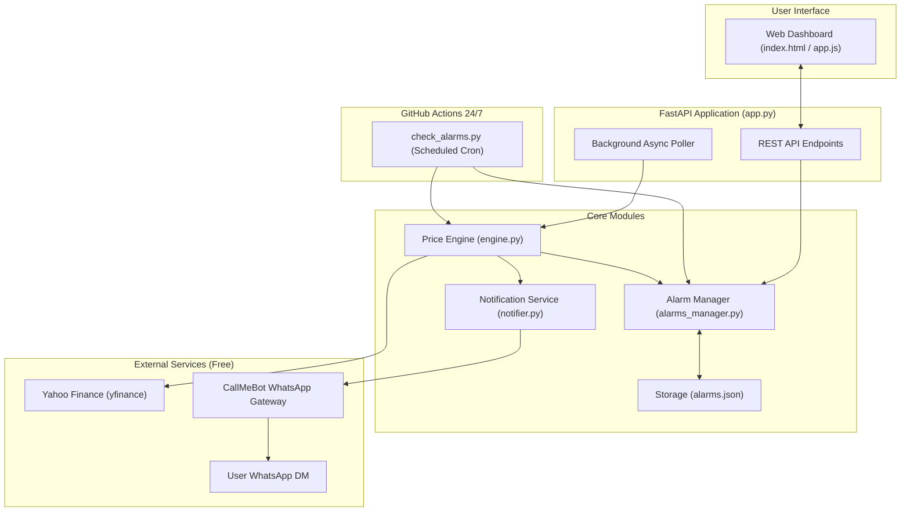

# Stock Price Alarmer Implementation Plan

> **For agentic workers:** REQUIRED SUB-SKILL: Use superpowers:subagent-driven-development to implement this plan task-by-task. Steps use checkbox (`- [ ]`) syntax for tracking.

**Goal:** Build a 100% free, 24/7 autonomous stock price tracking and alerting system that sends WhatsApp DM notifications via CallMeBot, managed through a modern local web dashboard and powered by GitHub Actions for zero-PC cloud operation.

**Architecture:** A Python-based modular architecture consisting of a price engine (`yfinance`), a notification gateway (`CallMeBot`), a persistent alarm manager (`alarms.json`), and a FastAPI web dashboard for local configuration. The same core engine runs headless in GitHub Actions on a 24/7 cron schedule without requiring a server to run on the user's PC.

**Architecture Diagram:**



**Tech Stack:**
- Python 3.12
- FastAPI & Uvicorn (Local API and static server)
- `yfinance` & `requests` (Free stock quotes and CallMeBot HTTP delivery)
- `pytest` & `pytest-asyncio` (Automated testing)
- HTML5 / Tailwind CSS (CDN) / Vanilla JavaScript (No Node.js build tools required)
- GitHub Actions (`ubuntu-latest`) for 24/7 cloud execution

## Global Constraints
- **Zero Paid Services**: All dependencies, APIs, and cloud resources must be completely free.
- **Privacy & Multi-Account Safety**: Phone numbers and API keys strictly loaded from environment variables (`.env` or GitHub Secrets). Local Git configuration isolated to personal account.
- **No Node.js / Build Steps**: Frontend must run directly as static assets.
- **Platform**: Fully compatible with Windows (local) and Linux (GitHub Actions).

---

### Task 1: Project Setup, Environment Isolation & Git Security

**Files:**
- Create: `.gitignore`
- Create: `requirements.txt`
- Create: `.env.example`
- Create: `config.py`
- Test: `tests/test_config.py`

**Interfaces:**
- Produces: `Config` object with `CALLMEBOT_PHONE`, `CALLMEBOT_APIKEY`, `POLL_INTERVAL_SECONDS`, and `DATA_FILE_PATH`.

- [ ] **Step 1: Write failing test for config loader**

```python
# tests/test_config.py
import os
from config import load_config

def test_load_config_defaults(monkeypatch):
    monkeypatch.setenv("CALLMEBOT_PHONE", "+1234567890")
    monkeypatch.setenv("CALLMEBOT_APIKEY", "test_key_123")
    cfg = load_config()
    assert cfg.phone == "+1234567890"
    assert cfg.apikey == "test_key_123"
    assert cfg.poll_interval == 60
```

- [ ] **Step 2: Run test to verify it fails**

Run: `python -m pytest tests/test_config.py`  
Expected: FAIL (ModuleNotFoundError: No module named 'config')

- [ ] **Step 3: Create .gitignore, requirements.txt, .env.example, and config.py**

Create `.gitignore` strictly ignoring `.env`, `alarms_local.json`, cache, and virtual environment.  
Create `requirements.txt` with `fastapi`, `uvicorn`, `yfinance`, `requests`, `python-dotenv`, `pytest`, `pytest-asyncio`.  
Create `config.py` loading settings from environment with `python-dotenv`.

- [ ] **Step 4: Run test to verify it passes**

Run: `python -m pytest tests/test_config.py`  
Expected: PASS

---

### Task 2: Core Stock Price Engine

**Files:**
- Create: `engine.py`
- Test: `tests/test_engine.py`

**Interfaces:**
- Consumes: Stock ticker symbol (e.g., `"AAPL"`), target price (`float`), condition (`"ABOVE"` / `"BELOW"`).
- Produces: `Quote` data class (`price: float, change_percent: float, currency: str`) and `evaluate_alarm(current_price, target_price, direction) -> bool`.

- [ ] **Step 1: Write failing test for price evaluation and quote fetching**

```python
# tests/test_engine.py
from engine import evaluate_alarm, StockEngine

def test_evaluate_alarm_above():
    assert evaluate_alarm(current_price=250.50, target_price=250.00, direction="ABOVE") is True
    assert evaluate_alarm(current_price=249.50, target_price=250.00, direction="ABOVE") is False

def test_evaluate_alarm_below():
    assert evaluate_alarm(current_price=120.00, target_price=125.00, direction="BELOW") is True
    assert evaluate_alarm(current_price=126.00, target_price=125.00, direction="BELOW") is False
```

- [ ] **Step 2: Run test to verify it fails**

Run: `python -m pytest tests/test_engine.py`  
Expected: FAIL (No module named 'engine')

- [ ] **Step 3: Implement `engine.py`**

Implement `evaluate_alarm` logic and `StockEngine.get_quote(ticker)` using `yfinance.Ticker(symbol).fast_info` with fallback to info or history for maximum resilience.

- [ ] **Step 4: Run test to verify it passes**

Run: `python -m pytest tests/test_engine.py`  
Expected: PASS

---

### Task 3: Notification Service (CallMeBot WhatsApp & Extensibility)

**Files:**
- Create: `notifier.py`
- Test: `tests/test_notifier.py`

**Interfaces:**
- Consumes: `BaseNotifier` interface.
- Produces: `CallMeBotWhatsAppNotifier` implementing `send_alert(ticker, current_price, target_price, direction, note) -> bool` and `send_raw_message(text) -> bool`.

- [ ] **Step 1: Write failing test for CallMeBot notifier formatting and HTTP dispatch**

```python
# tests/test_notifier.py
from unittest.mock import patch, MagicMock
from notifier import CallMeBotWhatsAppNotifier

@patch("notifier.requests.get")
def test_send_alert_calls_callmebot(mock_get):
    mock_response = MagicMock()
    mock_response.status_code = 200
    mock_response.text = "Message queued"
    mock_get.return_value = mock_response

    notifier = CallMeBotWhatsAppNotifier(phone="+1234567890", apikey="xyz123")
    success = notifier.send_alert(ticker="AAPL", current_price=251.20, target_price=250.00, direction="ABOVE")

    assert success is True
    assert mock_get.called
    args, kwargs = mock_get.call_args
    assert "https://api.callmebot.com/whatsapp.php" in args[0]
```

- [ ] **Step 2: Run test to verify it fails**

Run: `python -m pytest tests/test_notifier.py`  
Expected: FAIL (No module named 'notifier')

- [ ] **Step 3: Implement `notifier.py`**

Implement `BaseNotifier`, `CallMeBotWhatsAppNotifier`, and stub for future `TelegramNotifier`. Handle URL encoding, special characters, and network timeout exceptions.

- [ ] **Step 4: Run test to verify it passes**

Run: `python -m pytest tests/test_notifier.py`  
Expected: PASS

---

### Task 4: Persistent Alarm Manager & State Machine

**Files:**
- Create: `alarms_manager.py`
- Test: `tests/test_alarms_manager.py`

**Interfaces:**
- Consumes: JSON file path (`alarms.json`).
- Produces: `AlarmManager` class with methods:
  - `get_alarms() -> list[dict]`
  - `add_alarm(ticker, target_price, direction, note) -> dict`
  - `delete_alarm(alarm_id) -> bool`
  - `toggle_active(alarm_id) -> bool`
  - `mark_triggered(alarm_id, current_price) -> bool`
  - `reset_alarm(alarm_id) -> bool`

- [ ] **Step 1: Write failing test for alarm CRUD and anti-spam trigger state**

```python
# tests/test_alarms_manager.py
import tempfile
import os
from alarms_manager import AlarmManager

def test_alarm_lifecycle():
    with tempfile.NamedTemporaryFile(suffix=".json", delete=False) as f:
        temp_path = f.name
    try:
        mgr = AlarmManager(storage_path=temp_path)
        alarm = mgr.add_alarm(ticker="AAPL", target_price=250.0, direction="ABOVE", note="Breakout")
        assert alarm["ticker"] == "AAPL"
        assert alarm["triggered"] is False
        assert alarm["active"] is True

        # Test mark triggered (anti-spam state)
        mgr.mark_triggered(alarm["id"], current_price=251.0)
        updated = mgr.get_alarm(alarm["id"])
        assert updated["triggered"] is True

        # Test reset
        mgr.reset_alarm(alarm["id"])
        reset_alarm = mgr.get_alarm(alarm["id"])
        assert reset_alarm["triggered"] is False
    finally:
        os.remove(temp_path)
```

- [ ] **Step 2: Run test to verify it fails**

Run: `python -m pytest tests/test_alarms_manager.py`  
Expected: FAIL

- [ ] **Step 3: Implement `alarms_manager.py`**

Implement file-safe atomic reading and writing to `alarms.json`, ID generation (UUID), and alarm state updates.

- [ ] **Step 4: Run test to verify it passes**

Run: `python -m pytest tests/test_alarms_manager.py`  
Expected: PASS

---

### Task 5: FastAPI Backend & API Endpoints

**Files:**
- Create: `app.py`
- Test: `tests/test_api.py`

**Interfaces:**
- Produces: REST endpoints for alarms management, WhatsApp testing, and static file serving:
  - `GET /api/alarms`
  - `POST /api/alarms`
  - `DELETE /api/alarms/{id}`
  - `POST /api/alarms/{id}/reset`
  - `POST /api/test-whatsapp`
  - `GET /api/quote/{ticker}`

- [ ] **Step 1: Write failing test for API endpoints**

```python
# tests/test_api.py
from fastapi.testclient import TestClient
from app import app

client = TestClient(app)

def test_get_alarms():
    response = client.get("/api/alarms")
    assert response.status_code == 200
    assert isinstance(response.json(), list)
```

- [ ] **Step 2: Run test to verify it fails**

Run: `python -m pytest tests/test_api.py`  
Expected: FAIL

- [ ] **Step 3: Implement `app.py`**

Wire `FastAPI`, mount `static/` directory for frontend UI, register background polling task, and expose all endpoints.

- [ ] **Step 4: Run test to verify it passes**

Run: `python -m pytest tests/test_api.py`  
Expected: PASS

---

### Task 6: Modern Single-Page Web Dashboard

**Files:**
- Create: `static/index.html`
- Create: `static/app.js`
- Create: `static/style.css`

**Features:**
- Clean dark/light modern UI with Tailwind CSS CDN.
- Form to add new alarms (ticker, target price, condition, note).
- Alarm cards list showing ticker, current market price, target price, distance to target (%), triggered badge, and actions (Delete, Reset, Mute).
- Settings drawer to configure WhatsApp Phone Number & CallMeBot API key with "Test WhatsApp" button.
- Live polling every 30s to update prices in the browser view.

- [ ] **Step 1: Create `static/index.html` structure with Tailwind CSS**
- [ ] **Step 2: Implement `static/app.js` interacting with `/api/` endpoints**
- [ ] **Step 3: Test dashboard in browser and verify all API actions work smoothly**

---

### Task 7: 24/7 Cloud Background Check Script & GitHub Actions Workflow

**Files:**
- Create: `check_alarms.py`
- Create: `.github/workflows/stock_check.yml`

**Features:**
- `check_alarms.py`: Headless script that reads `alarms.json`, queries Yahoo Finance for active non-triggered alarms, triggers CallMeBot alerts if thresholds are breached, and saves state.
- `.github/workflows/stock_check.yml`: Runs on GitHub-hosted runner every 10-15 minutes or via `workflow_dispatch`, pulls secrets from GitHub Secrets, runs `check_alarms.py`, and commits changes back to the repository.

- [ ] **Step 1: Implement `check_alarms.py`**
- [ ] **Step 2: Write test for headless execution**
- [ ] **Step 3: Create `.github/workflows/stock_check.yml` with scheduled cron and secret masking**

---

### Task 8: Windows Quick Launcher & End-to-End Verification

**Files:**
- Create: `run.bat`
- Create: `README.md` (with setup guide for CallMeBot free key, GitHub Secrets, and local execution)

**Verification:**
- Run local server via `python app.py`.
- Add test alarm for a live stock.
- Verify live price is displayed.
- Test WhatsApp alert trigger.
- Verify Git status is clean and no secrets or personal info are staged.
