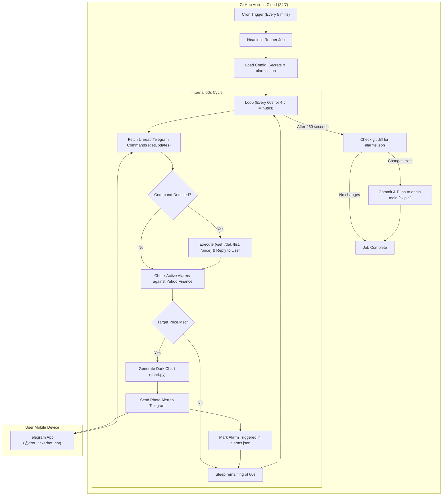

# Technical Design: TickerPing 24/7 Cloud Bot via GitHub Actions

**Date:** 2026-10-04  
**Author:** Antigravity & droritos  
**Status:** Approved  

---

## 1. Problem Statement & Motivation
Free cloud application servers (such as Render, Fly.io free tiers) automatically spin down and sleep after 10-15 minutes of inactivity. For continuous stock monitoring and instant push alerts, this causes missed price breakouts or dropped background loops. Furthermore, running local PC background workers requires leaving the user's computer powered on 24/7.

**Goal:** Provide a 100% free, autonomous, serverless stock alert bot that:
1. Runs 24/7 in the cloud without ever going to sleep.
2. Requires zero PC operation.
3. Allows the user to manage alarms directly from their phone via Telegram (`@dror_tickerbot_bot`).
4. Checks stock prices every 60 seconds during the active cloud execution window.
5. Sends rich visual alerts with stock price trend charts when targets are hit.

---

## 2. Architecture Overview

---

## 3. Detailed Component Design

### 3.1 GitHub Actions Workflow (`.github/workflows/stock_check.yml`)
- **Trigger**:
  - `schedule`: runs every 5 minutes (`*/5 * * * *`).
  - `workflow_dispatch`: enables 1-click manual trigger from GitHub UI anytime.
- **Concurrency**:
  - Sets `concurrency: group: tickerping-bot, cancel-in-progress: false` to ensure consecutive runs do not collide.
- **Permissions**:
  - `contents: write` to commit updated `alarms.json` back to repository.
- **Runner**:
  - Ubuntu latest with Python 3.12.
  - Dependencies: `yfinance`, `matplotlib`, `requests`, `python-dotenv`.

### 3.2 Cloud Execution Script (`cloud_runner.py`)
- **Max Execution Budget**: 260 seconds (~4.3 minutes), leaving a safe buffer before the 5-minute interval.
- **Interval**: 60 seconds per inner cycle (4 loops per GitHub Actions invocation).
- **Telegram Command Handling**:
  - Uses Telegram `getUpdates` with offset tracking.
  - Supports:
    - `AAPL 340` / `NVDA 120 ABOVE` -> Sets new alarm with smart direction detection.
    - `/list` -> Lists active alarms with current prices.
    - `/del <ticker>` -> Removes target alarm.
    - `/price <ticker>` -> Returns immediate live price quote.
    - `/check` -> Evaluates all alarms on demand.
    - `/help` or `/start` -> Shows command guide.
  - Direct replies sent via Telegram `sendMessage`.
- **Stock Price & Chart Evaluation**:
  - Pulls current prices using `yfinance` via `StockEngine`.
  - Compares with target price (`ABOVE` / `BELOW`).
  - When triggered:
    - Generates 5-day dark-theme price chart with target line overlay via `chart.py`.
    - Dispatches rich photo alert to Telegram chat via `sendPhoto`.
    - Updates alarm state to `triggered: True`.

### 3.3 State Persistence (`alarms.json`)
- Stores active alarms and the latest Telegram `update_id` offset so messages are never processed twice.
- If any alarms are added, deleted, or triggered, GitHub Actions commits `alarms.json` with `[skip ci]` at the end of the run.

---

## 4. Security & Credentials
- All sensitive tokens (`TELEGRAM_BOT_TOKEN`, `TELEGRAM_CHAT_ID`) are passed securely via GitHub Repository Secrets.
- Git commit identity uses GitHub's official automated actor (`github-actions[bot]`).

---

## 5. Verification Plan
1. **Local Test**: Run a single loop iteration locally to verify `getUpdates` command parsing and reply functionality.
2. **Commit & Push**: Push updated files to `droritos/TickerPing`.
3. **Manual Trigger**: Trigger workflow via GitHub Actions `workflow_dispatch` to verify clean execution and Telegram response.
4. **User Verification**: Send a test command from Telegram (`AAPL 400`) and confirm response on phone.
