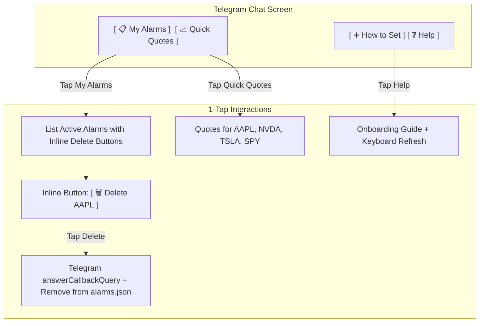

# Technical Design: Telegram Interactive Clickable Buttons for TickerPing

**Date:** 2026-10-06  
**Author:** Antigravity & droritos  
**Status:** Under Review  

---

## 1. Overview & Goal
Enable 1-tap mobile interactions for `@dror_tickerbot_bot` on Telegram so users can manage alarms, check stock prices, and delete triggers using visual buttons instead of manually typing syntax on mobile keyboards.

---

## 2. Interaction Design

### 2.1 Persistent Bottom Menu Keyboard (`ReplyKeyboardMarkup`)
A keyboard situated below the chat text entry with `resize_keyboard: true` and `is_persistent: true`:
- `📋 My Alarms`: triggers `handle_list()`
- `📈 Quick Quotes`: displays quick snapshot of popular tickers (AAPL, NVDA, TSLA, SPY)
- `➕ How to Set`: displays shorthand templates (`AAPL 350`, `TSLA 200 BELOW`)
- `❓ Help`: displays command reference

### 2.2 Inline Message Buttons (`InlineKeyboardMarkup`)
- **Under `/list`:**
  Each alarm displays an inline row:
  - `[🗑️ Delete AAPL]` (callback_data: `del:<alarm_id>`)
  - `[🌐 Yahoo Finance]` (url: `https://finance.yahoo.com/quote/<TICKER>`)
- **Under Alert Photo Notifications:**
  When a price threshold is reached and the chart is sent:
  - `[🌐 View on Yahoo Finance]` (url: `https://finance.yahoo.com/quote/<TICKER>`)
  - `[🗑️ Delete Alarm]` (callback_data: `del:<alarm_id>`)

### 2.3 Callback Query Processing
Telegram sends `callback_query` in `getUpdates`:
- The bot extracts `callback_query.id`, `callback_query.data`, and `callback_query.message.chat.id`.
- Calls `answerCallbackQuery(callback_query_id, text="...")` to dismiss the mobile loading spinner.
- Dispatches actions:
  - `del:<alarm_id>` -> deletes alarm via `AlarmManager`, confirms in chat.

---

## 3. Component Updates
1. **`telegram_command_handler.py`:**
   - Add default `reply_markup` (Persistent Reply Keyboard) to standard replies.
   - Add inline button generation for `/list`.
   - Add `handle_callback_query(query: Dict[str, Any])` method.
2. **`notifier.py`:**
   - Attach inline keyboard (`[🌐 Yahoo Finance]`, `[🗑️ Delete Alarm]`) to alert photos.
3. **`cloud_runner.py`:**
   - Handle both `update.get("message")` and `update.get("callback_query")`.
4. **`tests/test_telegram_command_handler.py`:**
   - Add test cases for reply keyboard markup, callback queries, and inline delete buttons.

---

## 4. Verification Plan
- Unit test coverage for keyboard generation and callback query handling.
- Verify GitHub Actions runner builds and tests cleanly.
- Verify live in Telegram: tap `📋 My Alarms` and click `[🗑️ Delete]` button.
